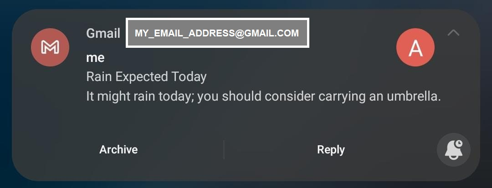

# Weather Rain Alert System

This Python script checks the weather forecast for a specified location using the OpenWeatherMap API and sends an email alert via Gmail if rain is expected today.



## API Integration Practice

Here, you can see an example of how to integrate a RESTful API into your Python projects. We use the OpenWeatherMap RESTful API to retrieve weather data for a specific location, demonstrating how to make RESTful HTTP requests, handle JSON responses, and extract useful information from an external API.

## Prerequisites

Before running the script, make sure you have the following:

1. An OpenWeatherMap API key. You can obtain one by signing up at [OpenWeatherMap](https://openweathermap.org/).

2. Gmail credentials for sending emails (sender's email address and password).

## Running on PythonAnywhere

This script is set up to run daily on [PythonAnywhere](https://www.pythonanywhere.com/) for automated weather alerts. You can schedule it to run at a specific time each day using PythonAnywhere's task scheduler; I have it set up to run at 6:00 AM and coded it to get the forecast for the next 15 hours, thereby informing me of the possibility of rain during basically the whole day.

To keep sensitive information secure, this script uses environment variables for API keys and email credentials. To set up the variables, pass them in the script running procedure on PythonAnywhere as seen below:

```bash
export API_KEY=your-key; export MY_EMAIL=your-email; export MY_PASSWORD=your-password; python3 main.py
```

## Usage

1. Configure the script with your desired location's latitude and longitude in the `weather_params` dictionary. Also, I have it set up to send a notification email to the same email address used as the sender because receiving a phone notification in the morning is sufficient for me. If you prefer to receive notifications from a different email address other than the sender's, you can make the necessary adjustments in the `main.py` code:

```python
connection.sendmail(from_addr=MY_EMAIL, to_addrs=desired_address, msg=message)
```

Simply replace desired_address with the email address from which you want to receive notifications.

2. If rain is expected today based on the weather forecast, the script will send you an email alert to your specified Gmail address.
